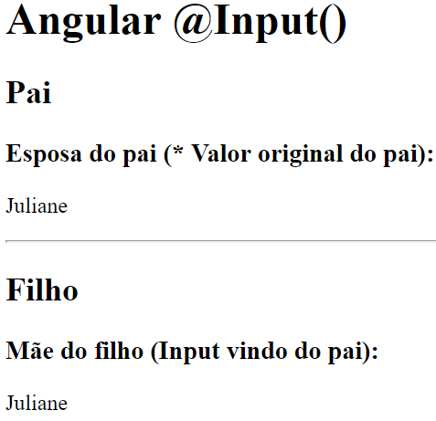

# Angular

_trabalhando com angular-cli_

> Angular é uma plataforma de aplicações web de código-fonte aberto e front-end baseado em TypeScript liderado pela Equipe Angular do Google e por uma comunidade de indivíduos e corporações. Angular é uma reescrita completa do AngularJS, feito pela mesma equipe que o construiu. [--Wiki](https://g.co/kgs/guUR7X)

## Table of Contents

TODO

---

## Anexos:

- [Adicionar Libs ao projeto: Bootstrap, Materialize]()
  <!-- TODO - [Typescrip]() -->

---

# Preparando o ambiente de desenvolvimento com Angular cli [:arrow_heading_up:](#table-of-contents)

[Angular cli reference](https://angular.io/cli)

Pre-requisitos:

- NodeJS instalado

```bash
sudo npm i -g @angular/cli
```

```bash
sudo npm i -g typescript
```

## Iniciar um novo projeto com o Angular cli

```bash
ng new app-name
```

Entre no diretório do projeto para começar a trabalhar nele:

```bash
cd app-name
```

## Rodando a aplicação

O comando abaixo irá fazer o build da aplicação e rodar no [http://localhost:4200/](http://localhost:4200/), você poderá acompanhar pelo browser o efeito das alterações do projeto.

```bash
ng serve
```

ou abreviado:

```bash
ng s
```

---

# Componentes

> Angular 2 é orientado a componentes, isso significa que você vai escrever diversos componentes minúsculos que juntos constituirão uma aplicação inteira. Um Component é a combinação de um template HTML com uma classe que controla parte da tela. [--Matera](http://www.matera.com/blog/post/comecando-com-angular-2)

É possível criar os componentes manualmente ou de forma mais simplificada, utilizando o `angular-cli`.

Os arquivos de componentes estão em:

**src >>> app**

## Criar componente utilizando o angular cli

Basta digitar no terminal:

```bash
ng g c nome-do-componente
```

ou se já existir o diretório:

```bash
ng g c diretorio/nome-do-componente
```

onde:

- g: gerar
- c: component

Esse comando irá criar a pasta do component e os arquivos.
Neste caso, ele também irá criar o arquivo html onde você deverá editar o conteúdo do seu component. É uma forma diferente da demonstrada no modo manual com template string, ambas as formas podem ser utizadas (template string, html separado).

No arquivo **nome-do-componente.component.ts**, gerado na criação do componente, haverá o seletor que você poderá usar no HTML, por exemplo:

No arquivo **btn.component.ts**:

```ts
import { Component, OnInit } from "@angular/core";

@Component({
  selector: "app-btn", // este seletor
  templateUrl: "./btn.component.html",
  styleUrls: ["./btn.component.sass"]
})
export class BtnComponent implements OnInit {
  constructor() {}

  ngOnInit() {}
}
```

O seletor **app-btn**, poderá ser usado no html como:

```html
<app-btn></app-btn>
```

**!Nota: se o component estiver importado no app.module.ts que é o module raíz do projeto, você também poderá utilizar o component dentro dos arquivos html de outros components.**

## Criar o primeiro componente manualmente

**> Arquivos**

**!Convenção: Criar nome das pastas e dos arquivos de componentes em Kebab Case (com letra minúscula e palavras separadas por "-")**

1. Cria a pasta nome
2. Cria o arquivo nome-component.ts

```ts
import { Component } from "@angular/core";

@Component({
  // nome da tag
  selector: "meu-primeiro-component",
  // conteúdo da tag
  template: `
    <p>Meu primeiro component com Angular 2!</p>
  `
})
export class MeuPrimeiroComponent {}
```

**!Convenção: classes são escritas em Pascal Case (todas as primeiras letras em maiúsculo)**

## Usar o component manualmente

Vá até o arquivo _.module.ts_.

Por exemplo, para usar no módulo raíz:
**app.module.ts**

1. Importe a classe:
2. Acrescente o component nas **declarations**.

Exemplo:

```ts
import { MeuPrimeiroComponent } from './meu-primeiro/meu-primeiro.component';

@NgModule({
  declarations: [
    AppComponent,
    MeuPrimeiroComponent
  ],
```

Vá até o arquivo html que deseja adicionar. Por exemplo:

**app.component.html**

adicione o componente onde desejar:

```html
<meu-primeiro-component></meu-primeiro-component>
```

## ng Content

TODO

Projeção de conteúdo:

```html
<app-example>
  <ng-content></ng-content>
</app-example>
```

# Templates

**html = template**

!Boa prática: no Component -> Utilizar template string somente se tiver até 3 linhas. Mais do que isso é recomendado um arquivo HTML a parte.

## Interpolação e Diretivas

### Interpolação

Podemos usar a interpolação para atribuir valores em um componente.

```
{{ x }}
```

Por exemplo:

no arquivo **exemplo.component.ts**

```ts
import { Component, OnInit } from "@angular/core";

@Component({
  selector: "app-exemplo",
  templateUrl: "./exemplo.component.html",
  styleUrls: ["./exemplo.component.sass"]
})
export class ExemploComponent implements OnInit {
  myName: string;

  constructor() {
    this.myName = "Lays";
  }

  ngOnInit() {}
}
```

Depois de ter feito todos as configurações necessárias no arquivo de **modules**.

Podemos utilizar a interpolação no arquivo **exemplo.component.html**

```html
<h2>Olá, meu nome é {{ myName }}!</h2>
```

Inserindo o componente para exibição, o resultado será:

**Olá, meu nome é Lays**

<!-- ### Diretivas

Exemplo:
**no arquivo numbers.component.ts:**

```ts
import { Component, OnInit } from "@angular/core";

@Component({
  selector: "app-numbers",
  templateUrl: "./numbers.component.html",
  styleUrls: ["./numbers.component.sass"]
})
export class NumbersComponent implements OnInit {
  numbers: string[] = ["1", "2", "3"];

  constructor() {}

  ngOnInit() {}
}
```

**no arquivo numbers.component.html:**

```html
<ul>
  <li *ngFor="let num of nums">{{ num }}</li>
</ul>
```

O resultado será:

- 1
- 2
- 3 -->

---

# Modules

> Em Angular, um módulo é um mecanismo para agrupar componentes, diretivas, canais e serviços relacionados, de forma que possam ser combinados com outros módulos para criar uma aplicação. Uma aplicação Angular pode ser vista como um quebra-cabeça onde cada peça (ou cada módulo) é necessária para poder ver a imagem completa.
> Outra analogia para entender os módulos angulares são as classes. Em uma classe, podemos definir **métodos públicos ou privados**. Os métodos públicos são a API que outras partes do nosso código podem usar para interagir com ela, enquanto os métodos privados são detalhes de implementação ocultos. Da mesma forma, um módulo pode exportar ou ocultar componentes, diretivas, tubulações e serviços. Os elementos exportados devem ser usados ​​por outros módulos, enquanto os que não são exportados (ocultos) são usados ​​apenas dentro do próprio módulo e não podem ser acessados ​​diretamente por outros módulos de nosso aplicativo. [--Angular 2 training book](https://angular-2-training-book.rangle.io/modules/introduction)

O angular-cli cria automaticamente um arquivo **app.modules.ts**:

(esse é o módulo raiz do projeto)

```ts
import { BrowserModule } from "@angular/platform-browser";
import { NgModule } from "@angular/core";
import { AppRoutingModule } from "./app-routing.module";

// importar components
// boa prática: agrupar os imports de components após pular uma linha dos imports iniciais
import { AppComponent } from "./app.component";
import { MeuPrimeiroComponent } from "./meu-primeiro/meu-primeiro.component";
import { Componente2Component } from "./componente2/componente2.component";

// declaratios, imports são metadados
@NgModule({
  // declarations: componentes, diretivas e pipes
  declarations: [AppComponent, MeuPrimeiroComponent, Componente2Component],
  // import: outros módulos para serem utilizados dentro deste módulo ou de algum componente que pertence a este módulo
  imports: [BrowserModule, AppRoutingModule],
  // providers: serviçoes disponíveis para os componentes, e nesse caso, na aplicação global, já que AppModule é global:
  providers: [],
  // instanciado no carregamento da SPA:
  bootstrap: [AppComponent]
})
export class AppModule {}
```

## Criar módulo

(esse é um módulo de funcionalidade do projeto)

Na pasta do projeto, digite no terminal:

```bash
ng g m nome-do-modulo
```

Ex:

```bash
ng g m my-module
```

irá criar um diretório com o nome do módulo (ex: my-module), com o arquivo **.ts** correspondente ao módulo criado:

```ts
import { NgModule } from "@angular/core";
import { CommonModule } from "@angular/common";

@NgModule({
  declarations: [],
  imports: [CommonModule]
})
export class MyModuleModule {}
```

## Adicionar componentes ao módulo

ver como [criar componentes](https://github.com/layshidani/my-learning-notes/blob/master/angular/components.md)

O **angular-cli** cuida dos imports dos componentes que são criados e das declarações, acrescentando-os no **app.module.ts**.

Se você tiver a extensão [Auto Import](https://marketplace.visualstudio.com/items?itemName=steoates.autoimport), ela irá acrescentar os imports necessários dos componentes no arquivo de módulo, porém é necessário acrescentar o trecho de **export** para indicar o que deve ser efetivamente exportado e exibido.

```ts
,
  exports: [
    NomeDoComponent
  ]
```

Assim, nosso arquivo de exemplo fica assim:

```ts
import { NgModule } from "@angular/core";
import { CommonModule } from "@angular/common";

import { BtnComponent } from "./btn.component";

@NgModule({
  declarations: [BtnComponent],
  imports: [CommonModule],
  exports: [BtnComponent]
})
export class BtnModule {}
```

_!Dica: Importar módulo -> Sempre que estiver trabalhando com mais módulo além do módulo **app.module.ts**, será necessário **exportar** este módulo em seu arquivo e **importar** no arquivo raíz._

Depois disso será necessário importar o módulo de funcionalidade dentro do módulo raíz (app.module.ts).

Exemplo:
no arquivo **app.module.ts**:

Importar a classe:

```ts
import { BtnModule } from "./btn/btn.module";
```

Em seguida, importar o módulo no NgModule:

```ts
@NgModule({
  declarations: [
    AppComponent,
    MeuPrimeiroComponent,
    Componente2Component
  ],
  imports: [
    BrowserModule,
    AppRoutingModule,
    BtnModule // importar o módulo aqui
  ],
  providers: [],
  bootstrap: [AppComponent]
})
```

Também é possível fazer uso de componentes privados, não incluindo-os no imports.

**!Nota: se o component estiver importado no app.module.ts que é o module raíz do projeto, você também poderá utilizar o component dentro dos arquivos html de outros components.**

---

# Services e Injeção de Dependência

> O serviço é simplesmente uma função javascript, juntamente com suas propriedades e métodos associados, que podem ser incluídos (via injeção de dependência) nos componentes do Angular 2. Eles permitem desenvolver código para tarefas específicas que podem ser usadas nesses componentes. [--Coursetro](https://coursetro.com/posts/code/20/Angular-2-Services-Tutorial---Understanding-&-Creating-Them)
> Angular distingue componentes de serviços para aumentar a modularidade e a reutilização. Ao separar a funcionalidade relacionada à visualização de um componente de outros tipos de processamento, você pode tornar suas classes de componentes simples e eficientes. [--Angular.io](https://angular.io/guide/architecture-services)

Para criar na raiz do projeto (dir app):

```bash
ng g s service-name
```

Para criar em um diretório de componente já existente:

```bash
ng g s dir-name/service-name
```

Este comando irá criar dois arquivos:

- service-name.service.spec.ts
- service-name.service.ts

!Boas práticas fazer o uso de services para injetar dados, ao invés de fazer direto por diretiva.

Utilizando o mesmo exemplo das diretivas:

Seguimos 3 passos:

1. no arquivo **numbers.service.ts**:

```ts
import { Injectable } from "@angular/core";

// @injectable é um decorator
@Injectable({
  providedIn: "root"
})
export class NumbersService {
  constructor() {}

  getNumbers() {
    // adiciona um return com os valores a serem injetados:
    return ["1", "2", "3"];
  }
}
```

2. no arquivo **numbers.component.ts**:

```ts
import { Component, OnInit } from "@angular/core";

// importar a classe NumbersService
import { NumbersService } from "./numbers.service";

@Component({
  selector: "app-numbers",
  templateUrl: "./numbers.component.html",
  styleUrls: ["./numbers.component.sass"]
})
export class NumbersComponent implements OnInit {
  // retirar o array daqui e inserir no arquivo de service:
  // numbers: string[] = ['1', '2', '3'];
  numbers: string[];

  // Instanciar via construtor (pode ser private ou public)
  constructor(private numbersService: NumbersService) {
    this.numbers = this.numbersService.getNumbers();
  }

  ngOnInit() {}
}
```

3. no arquivo **numbers.component.html**:

```html
<ul>
  <li *ngFor="let num of nums">{{ num }}</li>
</ul>
```

Por fim,
O resultado será:

- 1
- 2
- 3

---

# Data binding

- [Ótima Documentação](https://angular.io/guide/template-syntax)

Associação de informações que estão no componente para o template e vice-e-versa.

**componente <----info----> template**

componente ---> template

- interpolação: `{{x}}`
- property binding: `[propriedade]='x'`

template ---> component:

- evento: `(event)='handler'`

componente <---> template:

- Two-way data binding: `[(ngModel)='property']`

> Two-way data binding: a sincronização entre o model e a view. Quando os dados no model são alterados, a view reflete a alteração e, quando os dados da view mudam, o model também é atualizado. [--w3schools](https://www.w3schools.com/angular/angular_databinding.asp)

## componente ---> template

Exemplos:
Dado o arquivo:
**example.components.ts**

```ts
import { Component, OnInit } from "@angular/core";

@Component({
  selector: "app-example",
  templateUrl: "./example.component.html",
  styleUrls: ["./example.component.css"]
})
export class DataBindingComponent implements OnInit {
  url: string = "https://github.com/layshidani/my-learning-notes/";
  aprender: boolean = true;
  urlImagem: string = "http://lorempixel.com/400/200/animals/";

  getValor() {
    return "Hello";
  }

  praticar() {
    return true;
  }

  constructor() {}

  ngOnInit() {}
}
```

- interpolação: `{{x}}`
  **example.component.html**:

```html
<section>
  <h3>Interpolation</h3>
  <p>string rendereizada com interpolação: {{ url }}</p>
  <p>Interpolação com expressões: 1 + 1 = {{ 1 + 1 }}</p>
  <p>Interpolação com getValor: {{ getValor() }}</p>
  <p>Com expressão bool: {{ aprender && praticar() }}</p>
  
</section>
```

O resultado do código acima será:


- property binding: `[propriedade]='x'`
  Considerando o mesmo arquivo **example.components.ts**...

No html:

```html
<section>
  <h3>Property Binding</h3>
  <p>Property-biding (<code>[src]="urlImagem"</code>):</p>
  
  <!-- Os métodos são equivalentes -->
  <p>Que é o mesmo que (<code>bind-src="urlImagem"</code>):</p>
  
</section>
```

O resultado do código acima será:


**!Quando não houver uma property no elemento para ser utilizado no property-binding (como o src da img), pode-se utilizar como property:**

```html
[attr.colspan]="valor"
```

---

## Class Binding

> Adicione e remova nomes de classe CSS do atributo de classe de um elemento com uma vinculação de classe.
> Class Binding se parece com Property Biding, mas em vez de uma propriedade de elemento entre colchetes, começa com a classe de prefixo, opcionalmente seguida por um ponto (.) Eo nome de uma classe CSS: `[class.class-name]`. --[Angular guide](https://angular.io/guide/template-syntax)

Exemplo:

```html
<section>
  <article>
    <h3>Selecione uma classe:</h3>
    <!-- #var = variável local do template para que seja possível acessar esse select l (template reference variable) -->
    <select #classe (change)="0">
      <option value="alert-success">Sucesso</option>
      <option value="alert-danger">Erro</option>
    </select>
  </article>

  <article>
    <!-- [class.className]="expression" -->
    <div
      class="alert"
      role="alert"
      [class.alert-success]="classe.value == 'alert-success'"
    >
      A simple primary alert—check it out!
    </div>
    <div
      class="alert"
      role="alert"
      [class.alert-danger]="classe.value == 'alert-danger'"
    >
      A simple primary alert—check it out!
    </div>
  </article>
</section>
```

Alguns exemplos retirados do [Guia](https://angular.io/guide/template-syntax):

```html
<h3>Substituir todas as class:</h3>
<div class="item clearance special" [attr.class]="resetClasses">
  Reset all classes at once
</div>
```

```html
<h3>Add a class:</h3>
<div class="item clearance special" [class.item-clearance]="itemClearance">
  Add another class
</div>
```

```html
<h3>toggle the "special" class on/off with a property:</h3>
<div [class.special]="isSpecial">The class binding is special.</div>

<h3>binding to class.special overrides the class attribute:</h3>
<div class="special" [class.special]="!isSpecial">
  This one is not so special.
</div>

<h3>Using the bind- syntax:</h3>
<div bind-class.special="isSpecial">This class binding is special too.</div>
```

## Style Binding

> A sintaxe do Style binding se parece com a de Property Binding. Em vez de uma propriedade de elemento entre colchetes, comece com o estilo de prefixo, seguido por um ponto (.) E o nome de uma propriedade de estilo CSS: `[style.style-property]`. --[Guia](https://angular.io/guide/template-syntax)

Alguns exemplos:

```html
<button [style.color]="error ? 'red': 'green'">Red</button>
```

```html
<div
  class="alert alert-danger"
  role="alert"
  [style.display]="classe.value == 'alert-danger' ? 'block' : 'none'"
>
  Cuidado ERRO Selecionado
</div>
```

## Event Binding

[MDN - lista de eventos](https://developer.mozilla.org/en-US/docs/Web/Events)

Alguns exemplos de evento são:

- (click)="myFunction()"
- (submit)="myFunction()"
- (blur)="myFunction()"
- (focus)="myFunction()"
- (scroll)="myFunction()"
- (keyup)="myFunction()"
- (keypress)="myFunction()"
- (keydown)="myFunction()"
- (input)="myFunction()"

```html
<tag (target event name)="templateStatment()">Text</tag>
```

exemplo:

```html
<button (click)="onSave($event)">Save</button>
```

Outro exemplo:
no arquivo **event-example.component.html**:

```html
<h2
  (mouseover)="onMouseOverOut()"
  (mouseout)="onMouseOverOut()"
  [class.highlight]="isMouseOver"
>
  Passe o mouse sobre este texto :)
</h2>
```

no arquivo **event-example.component.ts**:

```ts
import { Component, OnInit } from "@angular/core";

@Component({
  selector: "app-event-example",
  templateUrl: "./event-example.component.html",
  styles: [
    `
      .highlight {
        background-color: green;
        font-weight: bold;
      }
    `
  ]
})
export class EventExampleComponent implements OnInit {
  isMouseOver: boolean = false;

  onMouseOverOut() {
    this.isMouseOver = !this.isMouseOver;
  }
  constructor() {}

  ngOnInit() {}
}
```

no arquivo **app.component.html**:

```html
<app-data-binding></app-data-binding>
```

## Two-way Data Binding

Propriedade + evento

```ts
[()]="value"
```

_!Dica: Quando trabalhando com formulários, deverá importar o `@angular/forms` no arquivo de **module.ts**:_

```ts
// ...
// importa o módulo
import { FormsModule } from '@angular/forms'

@NgModule({
 // ...
  imports: [
    //...
    // add no imports
    FormsModule
  ],
  providers: [],
  bootstrap: [AppComponent]
})
// ...
```

Exemplo:

Supondo um objeto chamado pet, que está no arquivo **component.ts**:

```ts
pet = {
  name: "Dexter",
  age: 2
};
```

No **component.html** teremos:

```html
<section>
  <h3>Two-way Data Binding</h3>
  <input type="text" [(ngModel)]="'Nome: ' + pet.name" />
  <input type="text" [(ngModel)]="'Idade: ' + pet.age" />
  <h4>Resultado:</h4>
  <p>
    Pet: Meu nome é {{ pet.name }} e tenho {{ pet.age }} ano(s) :)
  </p>
</section>
```

## Input/Output Properties - Comunicação entre componentes

[IT Next - input/output tutorial.](https://itnext.io/angular-input-output-f0418ab4cc91)

Utilizar dados de um componente em outro.

Considere um componente pai e um componente filho:

- Input: de pai para filho (de fora para dentro)
- Output: de filho para pai (de dentro para fora)

### Input

> de pai para filho (de fora para dentro)

Por padrão, as propriedades de um componente só estão disponíveis para ele mesmo, se quisermos expo-las para outro componente, devemos utilizar o input.

No arquivo **filho.component.ts** importamos os dados do componente pai para que possam ser utilizados pelo componente filho:

```ts
// não esquecer de importar a classe Input do @angular/core
import { Component, OnInit, Input } from '@angular/core';

// ...

@Input() originalName: type;

// ou podemos usar um nome de variável diferente
@Input('originalName') alias: type;
```

no componente pai (**pai.component.html**) ao utilizarmos o componente filho através de sua tag, devemos 'disponibilizar/repassar' a variável correspondente ao dado através dos properties:

```html
<app-filho [variable]="variable"></app-filho>

<!-- ou para uso de hardCoded, valor cravado, não precisa de [] -->
<app-filho variable="10"></app-filho>

<!-- ou em caso de nome diferente -->
<app-filho [alias]="originalName"></app-filho>
```

Exemplo:

**pai.component.ts**:

```ts
import { Component } from "@angular/core";

@Component({
  selector: "app-root",
  templateUrl: "./app.component.html",
  styleUrls: ["./app.component.css"]
})
export class AppComponent {
  title = "input";

  esposa: string;

  constructor() {
    this.esposa = "Juliane";
  }
}
```

**pai.component.html**

```html
<h1>Angular @Input()</h1>
<h2>Pai</h2>
<h3>Esposa do pai (* Valor original do pai):</h3>
<p>{{ esposa }}</p>

<hr />

<!-- Aqui, estamos passando utilizando um alias (esposaDoPai) para passar ao filho o valor de esposa que vem do pai -->
<app-filho [esposaDoPai]="esposa"></app-filho>
```

**filho.component.ts**

```ts
// import do Input no @angular/core
import { Component, OnInit, Input } from "@angular/core";

@Component({
  selector: "app-filho",
  templateUrl: "./filho.component.html",
  styleUrls: ["./filho.component.css"]
})
export class FilhoComponent implements OnInit {
  // Pega o Input do pai (esposaDoPai) e utiliza no filho como mãe
  @Input("esposaDoPai") mae;

  constructor() {}

  ngOnInit() {}
}
```

**filho.component.html**

```html
<h2>Filho</h2>
<h3>Mãe do filho (Input vindo do pai):</h3>
<p>{{ mae }}</p>
```

Resultado:


### Output

---

TODO escrever sobre:

- Output
- EventEmitter()
- ViewChild()
- ContentChild()

---

> de filho para pai (de dentro para fora)

```ts
// importar a classe Output do @angular/core
import { Component, OnInit, Output } from '@angular/core';

// utilizar o decorator @Output
@Output() originalName: type

// ou podemos usar um nome de variável diferente
@Output('alias') originalName: type
```

## Local reference

Pode ser utilizado em qualquer elemento HTML.

```html
<input #localReferenceName />
```

Exemplo:

```html
<!-- guardamos a referência local do select em #num -->
<!-- na mudança de opção ele passa o valor para a função  selectedValue -->
<select #num (change)="selectedValue(num)">
  <option value="1">1</option>
  <option value="2">2</option>
</select>

<!-- mostramos o valor selecionado com interpolação -->
<p>O valor selecionado é {{ selectedNum }}</p>
```

```ts
// ...
export class AppComponent {
  // declaramos um valor inicial/padrão do selectedNum,porque ele sempre vai começar com o primeiro option pré selecionado
  selectedNum = "1";

  // agora passamos para a função selectedValue o num que será do tipo HTMLInputElement
  selectedValue(num: HTMLInputElement) {
    // mudamos o valor do selectedNum pelo valor selecionado com num.value
    this.selectedNum = num.value;
  }
  // ...
}
```

---

# Alguns Comandos angular-cli

[Documentação](https://angular.io/cli)

## Build

```bash
ng build
```

- default dev : sem minificação
- `--prod`: minificado

irá gerar o folder _dist_ com os arquivos do **build**.

!dica: lib npm **http-server** para rodar a aplicação.

## Verificar lint

```bash
ng lint
```

## Teste unitário

```bash
ng test
```

### Teste end-to-end com Protractor

```bash
ng e2e
```

## Modificar estilo de um projeto existente

**!Modifica apenas os próximos componentes, os já existentes continuarão com as extensões selecionadas anteriormente. Para modificar, será necessário mudar as extensões manualmente nos arquivos.**

```bash
ng set defaults.styleExt <estilo>
```

Estilo:

- `scss` para sass
- `less` para less
- `styl` para stylus

---

# Diretivas

> Angular 2 categoriza diretivas em 3 partes:
>
> 1. Diretivas com modelos conhecidos como Componentes
> 2. Diretivas que criam e destroem elementos DOM conhecidos como **Diretivas Estruturais**
> 3. Diretivas que manipulam o DOM alterando o comportamento e a aparência conhecidas como **Diretivas de Atributo**
>    --[codementor.io](https://www.codementor.io/christiannwamba/build-custom-directives-in-angular-2-jlqrk7dpw)

## Diretivas Estruturais

> Diretivas estruturais são responsáveis pelo layout HTML. Eles moldam ou reformulam a estrutura do DOM, geralmente adicionando, removendo ou manipulando elementos. --[Angular Guide](https://angular.io/guide/structural-directives#what-are-structural-directives)

### ngFor

```
*ngFor="expression"
```

Exemplo:
Considere um array de números declarados no arquivo **example.component.ts**,
`arr = [1, 2, 3];`:

```html
<ul>
  <li *ngFor="let num of arr">{{ num }}</li></li>
</ul>
```

Neste caso, será gerado um `<li>` para cada número do array.

Resultado:

- 1
- 2
- 3

### ngIf

```
*ngIf="expression"
```

Exemplo:
Considere este select de **example.component.html**:

```html
<select #num (change)="selectedValue(num)">
  <option value="1">1</option>
  <option value="2">2</option>
  <option value="3">3</option>
</select>

<p *ngIf="selectedNum <= '2'">O valor selecionado é {{ selectedNum }}</p>
```

Neste caso, será feita a validação da expressão: `selectedNum <= '2'` e a tag `<p>` só será exibida caso a validação seja positiva (1 e 2).

### ngElse

TODO

### ngSwitch

O ngSwitch funciona como o switch que utilizamos no js comum.

Só para relembrarmos como é o switch no js:

```js
switch (expression) {
  case x:
    // code block
    break;
  case y:
    // code block
    break;
  default:
  // code block
}
```

Exemplo:

ao clicarmos nos botões abaixo queremos exibir uma mensagem de acordo com o botão

```html
<!-- ao clicarmos atribuimos o valor a variavel msg -->
<button type="button" class="btn btn-primary" (click)="msg = 'warning'">
  ok
</button>
<button type="button" class="btn btn-success" (click)="msg = 'success'">
  Success
</button>
<button type="button" class="btn btn-danger" (click)="msg = 'danger'">
  Danger
</button>
<button type="button" class="btn btn-warning" (click)="msg = 'warning'">
  Warning
</button>

<!-- aqui estão as mensagens. Fazemos a verificação: -->
<!-- [ngSwitch]="msg"  -->
<div class="container" [ngSwitch]="msg">
  <!-- ngSwitchDefault: msg padrão -->
  <p *ngSwitchDefault>Clique em um botão</p>
  <!-- caso a msg = ok exibimos esse parágrafo -->
  <p *ngSwitchCase="'ok'">OK! :D</p>
  <!-- caso a msg = success exibimos esse parágrafo, etc -->
  <p *ngSwitchCase="'success'">Sucesso! :)</p>
  <p *ngSwitchCase="'danger'">Perigo! :z</p>
  <p *ngSwitchCase="'warning'">Atenção! 8/</p>
</div>
```

## Diretivas de atributo

### ngClass

> É usado para adicionar e remover classes CSS em um elemento HTML. Podemos vincular várias classes CSS ao NgClass simultaneamente, que podem ser adicionadas ou removidas. Existem diferentes maneiras de vincular classes CSS a NgClass que estão usando string, array e objeto. --[Concrete Page](https://www.concretepage.com/angular-2/angular-2-ngclass-example)

Aplica uma classe CSS.
Ao utilizar '-' deve-se estar entre aspas simples (ex: 'background-color') ou utilizar CamelCase (ex: **backgroundColor**)

```html
[ngClass]="{'classe-css': expression}"

<!-- varias -->
[ngClass]="{ 'classe-css': expression, 'classe-css': expression, 'classe-css':
expression }"
```

Exemplo:

```html
<ul *ngFor="let fruit of fruits">
  <li
    [ngClass]="{
    'text-red': fruit.name === 'apple',
    'text-yellow': fruit.name === 'banana',
    'text-orange': fruit.name === 'orange'
  }"
  >
    {{ fruit.name }}
  </li>
</ul>
```

#### Sintaxe alternativa para ngClass

```html
[class.prop]="value"
```

### ngStyle

Aplica uma propriedade CSS.
Ao utilizar '-' deve-se estar entre aspas simples (ex: 'background-color') ou utilizar CamelCase (ex: **backgroundColor**)

```
[ngStyle]="{propCSS: expression}"

<!-- em casos que se usam unidades: -->
[ngStyle]={'propCSS.unit': value}
```

Exemplos:

```html
<!-- simples, atribui a cor azul ao background-color deste elemento -->
<p [ngStyle]="{ backgroundColor: 'blue' }">{{ person.age }}</p>

<!-- com expressão -->
<p [ngStyle]="{ backgroundColor: person.age > 18 ? 'green' : 'yellow' }"></p>

<!-- com unidade em -->

<p [ngStyle]="{ 'fontSize.em': 2.5}">{{ person.age }}}</p>
```

#### Sintaxe alternativa ngStyle

```html
[style.<property
  >]=""

  <!-- em casos que se usam unidades: -->

  [style.<property>.<unit>]=""</unit></property></property
>
```

Exemplo:

```
[style.color]="green"

<!-- para aplicar uma font-size de 16px -->
[style.font-size.px]="16"
```

## Diretivas customizadas

TODO

```bash
ng g d dir/directive-name
```

geralmente criamos no dir **shared**.

Será gerado um arquivo **directive-name.directive.ts**

```ts
// importar o ElementRef e o Renderer
import { Directive, ElementRef, Renderer } from "@angular/core";

@Directive({
  // este nome do seletor deverá ser utilizado na tag html que receberá a diretiva
  selector: "[appDiretivaExample]"

  // para restringir a tag a que esse diretiva poder ser aplicada, basta adicionar o nome da tag 'nome-da-tag[nomeDiretiva]', inclusive para tag componentes
  // selector: 'button[appDiretivaExample]'
})
export class DiretivaExampleDirective {
  // geralmente utilizamos a inicial _ na nomeação para indicar que é uma variável privada
  constructor(private _elementRef: ElementRef, private _renderer: Renderer) {
    // aplicamos as modificações
    this._renderer.setElementStyle(
      this._elementRef.nativeElement,
      "background-color",
      "red"
    );

    // este console.log mostra os atributos que podem ser modificados
    // console.log(this._elementRef);

    // Boas práticas: o uso do ElementRef, para modificação direta do DOM, não é recomendado por questoes de vulnerabilidade da aplicação. Assim, é recomendado utilizar o Renderer
    // this._elementRef.nativeElement.style.backgroundColor = 'green';
  }
}
```

para aplicar a diretiva customizada na tag:

```html
<h1>Diretiva Customizada</h1>
<button appDiretivaExample>Exemplo</button>
```

## HostListener

Permite ouvir eventos no elemento ou componente hospedeiro (host).

Neste exemplo, mudamos o tamanho da fonte quando passamos o mouse sobre o texto

```ts
// importa HostListener
import { Directive, ElementRef, Renderer, HostListener } from "@angular/core";

@Directive({
  // este nome do seletor deverá ser utilizado na tag html que receberá a diretiva
  selector: "[appHighlightMouse]"
})
export class HighlightMouseDirective {
  // @HostListener('nomedoevento') função() {}
  @HostListener("mouseenter") onMouseEnter() {
    this._renderer.setElementStyle(
      this._elementRef.nativeElement,
      "font-size",
      "2em"
    );
  }

  @HostListener("mouseleave") onMouseLeave() {
    this._renderer.setElementStyle(
      this._elementRef.nativeElement,
      "font-size",
      "1em"
    );
  }

  constructor(private _elementRef: ElementRef, private _renderer: Renderer) {}
}
```

## HostBinding

Permite definir propriedades no elemento ou componente hospedeiro (host) da diretiva por meio de uma variável.

Este exemplo faz o mesmo que o demonstrado em HostListener, porém de uma maneira otimizada utilizando o HostBinding.

HostingListener + HostBinding:

```ts
// importa HostBinding
import {
  Directive,
  ElementRef,
  Renderer,
  HostListener,
  HostBinding
} from "@angular/core";

@Directive({
  selector: "[appHighlightMouse]"
})
export class HighlightMouseDirective {
  @HostListener("mouseenter") onMouseEnter() {
    // utilizando HostBinding
    this.changeSize = "2em";

    // método anterior
    // this._renderer.setElementStyle(
    //   this._elementRef.nativeElement,
    //   'font-size',
    //   '2em'
    // )
  }

  @HostListener("mouseleave") onMouseLeave() {
    // utilizando HostBinding
    this.changeSize = "1em";

    // método anterior
    // this._renderer.setElementStyle(
    //   this._elementRef.nativeElement,
    //   'font-size',
    //   '1em'
    // )
  }

  // @HostBinding('style.cssAtributeName') varName: type;
  @HostBinding("style.fontSize") changeSize: string;

  constructor() // private _elementRef: ElementRef,
  // private _renderer: Renderer
  {}
}
```

---

# Operador Elvis (?)

Exemplo:

```html
<!-- elvis -->
<h1>{{ person?.name }}</h1>

<!-- é o mesmo que  -->
<h1>{{ person != null ? person.name : '' }}</h1>
```

# Model

TODO

---

# Services

> _Service_ é uma categoria abrangente que inclui qualquer valor, função ou recurso de que um aplicativo precisa. Um serviço é tipicamente uma classe com um propósito estreito e bem definido. Deve fazer algo específico e fazê-lo bem.

> Angular distingue componentes de serviços para aumentar a modularidade e a reutilização.

> Ao separar a funcionalidade relacionada à visualização de um componente de outros tipos de processamento, você pode tornar suas classes de componentes simples e eficientes.

> Idealmente, o trabalho de um componente é permitir a experiência do usuário e nada mais. Um componente deve apresentar propriedades e métodos para vinculação de dados, a fim de mediar entre a visualização (renderizada pelo modelo) e a lógica do aplicativo (que geralmente inclui alguma noção de um modelo).

> Um componente pode delegar determinadas tarefas aos serviços, como buscar dados do servidor, validar a entrada do usuário ou registrar-se diretamente no console. Ao definir essas tarefas de processamento em uma classe de serviço injetável, você torna essas tarefas disponíveis para qualquer componente. Você também pode tornar seu aplicativo mais adaptável injetando diferentes provedores do mesmo tipo de serviço, conforme apropriado em diferentes circunstâncias. --[angular.io](https://angular.io/guide/architecture-services)

```bash
ng g service <name>
```

- DRY
- Manutenção
- Facilidade para migrar para outras tecnologias

Os _services_ geralmente são classes que reunem os métodos para serem utilizados pelos componentes.

Assim:
-> Componente: interação usuário
-> Serviço: cérebro, lógica do negócio, classes utilitárias.

Exemplo:
TODO

## Injeção de dependências

TODO

---

# Rotas

TODO

**app.component.html**:
add a tag router-outlet onde será renderizado o componente de rota

```html
<router-outlet></router-outlet>
```

**app-routing.module.ts**:

```ts
import { NgModule } from "@angular/core";
// importar Routes e RoutersModule
import { Routes, RouterModule } from "@angular/router";
// importar ModuleWithProviders
import { ModuleWithProviders } from '@angular/core';

// importar componentes
import { LoginComponent } from "./login/login.component";
import { HomeComponent } from "./home/home.component";

// add path e o nome dos componentes
// que seriam o caminho/endereço e o componente que deverá ser renderizado para esse caminho
const routes: Routes = [
  // um caminho default
  { path: "", pathMatch: "full", redirectTo: "login" }
  // outras rotas
  { path: "login", component: LoginComponent },
  { path: "home", component: HomeComponent }
];

// para rotas principais
export const routing: ModuleWithProviders = RouterModule.forRoot(APP_ROUTES);

// rotas de funcionalidade usar forChild (ex: recipes-detail)
// export const routing: ModuleWithProviders = RouterModule.forChild(APP_ROUTES);

@NgModule({
  imports: [RouterModule.forRoot(routes)],
  exports: [RouterModule]
})
export class AppRoutingModule {}
```

no arquivo **app.module.ts**:

```ts
// importar o arquivo de rotas
import { routing } from './app.routing';

// ...
// add aos imports
@NgModule({
  // ...
  imports: [
    // ...
    routing
  ],
  providers: [],
  bootstrap: [AppComponent]
})
```

## Adicionar link de rota (routerLink)

adicionar o `routerLink` com o caminho que foi criado no arquivo de rotas.

```html
<a routerLink="/path">path</a>

<!-- exemplo -->
<a routerLink="/login">Login</a>
```

---

## Rota com parâmetros

- obter o parâmetro
- subscribe
- unsubscribe

o que vai mudar de um caso para o outro é o conteúdo de exemplo do arquivo **welcome-page.component.ts**.

**app-routing.module.ts**:

```ts
// ...
import { WelcomeComponent } from "./welcome/welcome.component";

// ...
  // rota com parâmetro rota/:parametro
  { path: "home/:welcome", component: WelcomeComponent }

// ...
```

no **home.component.html**:

```html
<!-- exemplo -->
<input #name />

<a [routerLink]="['welcome', name.value]">Boas vindas</a>
```

Para exibir um valor na tela, supondo que temos um input onde o usuário digita seu nome na página home (**home.component.html**):

**welcome-page.component.html:**

```html
<h2>Olá, {{ name }}, seja bem vinda (o)!</h2>
```

### Obter parâmetro

**welcome-page.component.ts:**

```ts
import { Component, OnInit } from '@angular/core';
import { ActivatedRoute } from '@angular/router';

@Component({
  selector: 'app-welcome-page',
  templateUrl: './welcome-page.component.html',
  styleUrls: ['./welcome-page.component.css']
})
export class WelcomePage implements OnInit {

  name: string;

  constructor(private route: ActivatedRoute) {
    console.log(this.route.snapshot.params['name]);
    this.id = this.route.snapshot.params['name];
   }

  ngOnInit() {
  }

}
```

### Subscribe e unsubscribe

**welcome-page.component.ts:**

```ts
import { Component, OnInit } from "@angular/core";
import { ActivatedRoute } from "@angular/router";
// add import do Subscription
import { Subscription } from "rxjs";

@Component({
  selector: "app-welcome-page",
  templateUrl: "./welcome-page.component.html",
  styleUrls: ["./welcome-page.component.css"]
})
export class WelcomePage implements OnInit {
  name: string;
  // add uma variável do tipo Subscription
  subscription: Subscription;

  constructor(private route: ActivatedRoute) {}

  // subscribe
  ngOnInit() {
    this.subscription = this.route.params.subscribe((params: any) => {
      this.name = params["name"];
    });
  }

  // unsubscribe
  ngOnDestroy() {
    this.subscription.unsubscribe();
  }
}
```

# Rotas imperativas

TODO

```ts
import { ActivatedRoute, Router } from "@angular/router";

// exemplo, faz a validação do dado e redireciona para outra página
if (this.name == null) {
  this.router.navigate(["/error"]);
}
```

_!não esquecer que todos os caminhos devem estar declarados no aquivo de rotas._

## Definir parâmetro de url (query)

Exemplo:

```html
<!-- !nota: 'notebook' está entre aspas simples, porque é uma string -->
<button routerLink="/produtos" [queryParams]="{prod:'notebook'}">
  Produtos
</button>

<button routerLink="/produtos" [queryParams]="{pagina:21}">Produtos</button>
```

Assim, quando clicado neste botão, irá acrescentar os parâmetros solicitados na url da página:
_http://localhost:4200/produtos?pagina=notebook_

## Extrair parâmetro da url

Exemplo:

Um botão que ao ser clicado muda para a próxima página.

```html
<button (click)="nextPage()">Próxima página</button>
```

em **produtos.components.ts**:

```ts
// acrescentar os imports necessários
import { Subscription } from "rxjs";
import { ActivatedRoute, Router } from "@angular/router";

@Component({
  selector: "app-produtos",
  templateUrl: "./produtos.component.html",
  styleUrls: ["./produtos.component.css"]
})
export class produtosComponent implements OnInit {
  page: number;
  subscription: Subscription;

  constructor(private activatedRoute: ActivatedRoute, private router: Router) {}

  ngOnInit() {
    this.subscription = this.activatedRoute.queryParams.subscribe(
      (queryParams: any) => {
        this.page = queryParams["page"];
      }
    );
  }

  ngOnDestroy() {
    this.subscription.unsubscribe();
  }

  nextPg() {
    // a expressão abaixo muda a url para outro caminho utilizando a classe Router no @angular/router
    // e vai somando 1 à página a cada vez que o botão é clicado
    // http://localhost:4200/produtos?page=2
    this.router.navigate(["/produtos"], { queryParams: { page: ++this.page } });
  }
}
```

# Forms: Template Driven e Data Driven

**!não esquecer de importar o FormsModule no módulo**:

```ts
import { FormsModule } from "@angular/forms";
```

- Template Driven:
  - **orientado a template**
  - criação, configuração e validação no HTML (template)
  - FormGroup criado pelo Angular do HTML
  - form submetido através do `ngSubmit`
- Data Driven (Reativos)
  - **orientado a dados**
  - você programa o formulário e sincroniza com o DOM. A manipulação é feita via código no component.
  - criação, configuração e validação no componente
  - FormGroup no componente
  - não é necessário ngSubmit

## Template Driven

TODO ex msg de erro
TODO serValue
TODO patch value
TODO HTTP Post

Exemplo:
no arquivo **template-drive.component.html**

```html
<!-- criar var (ex #myForm) para referenciar o formulário -->
<!-- ngForm: angular passa a ajudar a gerenciar -->
<form #myForm="ngForm" (ngSubmit)="onSubmit(myForm)">
  <div class="form-group">
    <label for="nome">Nome</label>
    <!-- acrescentar ngModel e um name para associação -->
    <input
      type="text"
      class="form-control"
      id="nome"
      name="nome"
      placeholder="Nome"
      ngModel
    />
  </div>

  <div class="form-group">
    <label for="email">Email</label>
    <input
      type="email"
      class="form-control"
      id="email"
      name="email"
      placeholder="nome@email.com"
      ngModel
    />
  </div>

  <button type="submit" class="btn btn-primary">Submit</button>
</form>
```

no arquivo **template-drive.component.ts**

```ts
import { Component, OnInit } from "@angular/core";

@Component({
  selector: "app-template-form",
  templateUrl: "./template-form.component.html",
  styleUrls: ["./template-form.component.css"]
})
export class TemplateFormComponent implements OnInit {
  user: any = {
    name: "Lays",
    email: "lays@lays.com"
  };

  onSubmit(form) {
    // retorna os valores associados através da referência name e ngModel
    console.log(form.value);
    // ou
    console.log(this.user);
  }

  constructor() {}

  ngOnInit() {}
}
```

## Data Driven: Formulários reativos

no _module.ts_:

- importar o **ReactiveFormsModule**
- adicionar aos imports

no _component.ts_, importar a classe:

- Importar as classes FormGroup e FormControl (ou FormBuilder)
- criar uma variável do tipo FormGroup

<!-- TODO add content, verify examples -->

arquivo **app.module.ts** (ou no módulo que for utilizar):

```ts
import { BrowserModule } from "@angular/platform-browser";
import { NgModule } from "@angular/core";
// importar ReactiveFormsModule
import { ReactiveFormsModule } from "@angular/forms";

// ...

@NgModule({
  // ...
  imports: [
    // ...
    // add nos imports
    ReactiveFormsModule
  ]
  //...
})
export class AppModule {}
```

**reactive-form.component.ts**:

```ts
import { Component, OnInit } from "@angular/core";
// Importar a classe FormGroup e FormControl/FormBuilder
import { FormGroup, FormControl } from "@angular/forms";

@Component({
  selector: "app-data-form",
  templateUrl: "./data-form.component.html",
  styleUrls: ["./data-form.component.css"]
})
export class DataFormComponent implements OnInit {
  // declarar uma variável do tipo FormGroup
  form: FormGroup;

  //  maneira com FormBuilder
  constructor(private formBuilder: FormBuilder) {}

  ngOnInit() {
    this.form = this.formBuilder.group({
      name: ["Valor inicial nome"],
      email: ["Valor inicial email"]
    });
  }

  // ou
  // com new FormControl
  // constructor() { }
  // ngOnInit() {
  //   this.form = new FormGroup({
  //     name: new FormControl('Valor Nome Inicial'),
  //     email: new FormControl('Valor Email Inicial'),
  //   });
  // }
}
```

no html:

```html
<!-- add a diretiva [formGroup]="variable name" para linkar com a variável que está no componente -->
<!-- add (ngSubmit)="onSubmit() vinculado ao component.ts -->
<form [formGroup]="form" (ngSubmit)="onSubmit()">
  <!-- ... -->
  <!-- add formControlName para linkar e atualizar o valor das variáveis do formBuilder de acordo com o input -->
  <input formControlName="email" />
  <!-- ... -->
</form>
```

## Forms validation
[Validation Angular.io](https://angular.io/guide/form-validation)

Nessa abordagem de formulário reativo, controlamos os forms pelo componente e não pelo template (DOM), por isso ao invés de simplesmente colocar um atributo `required` na tag HTML, fazemos isto através de código no componente.

Exemplo utilizando o Validators do @angular/forms:
- importar a classe Validators
- fazer as validações através do FormControl
  * `new FormControl(defaultValueOfTheInput, Validators)`, se for mais de um tipo de validação, utilizar array: `new FormControl(null, [Validators.required, Validators.email])`

*app.component.ts*:
```ts
// importar a classe Validators
import { FormGroup, FormControl, Validators } from '@angular/forms';

// ...

ngOnInit() {
  // add validações ao FormGroup
  this.signupForm = new FormGroup({
    'username': new FormControl(null, Validators.required),
    'email': new FormControl(null, [Validators.required, Validators.email]),
    'gender': new FormControl('female')
  });
}
```

Podemos exibir mensagens adicionais no HTML para informar o usuário. Exemplo, um `input` de email:

```html
<div class="form-group">
  <label for="email">email</label>
  <input
    type="text"
    id="email"
    class="form-control"
    formControlName="email">
    <!-- utilizando ngIf -->
    <span
    *ngIf="!signupForm.get('email').valid && signupForm.get('email').touched"
    class="help-block">Dado Inválido</span>
</div>
```

### Custom Validation
Suponha um input, onde o usuário digita o nome de um produto, e queremos validar, se este produto está na lista de produtos que acabaram.

```ts
import { Component, OnInit } from '@angular/core';
// Importar as classes
import { FormGroup, FormControl, Validators, FormArray, FormBuilder } from '@angular/forms';

@Component({
  selector: 'app-root',
  templateUrl: './app.component.html',
  styleUrls: ['./app.component.css']
})

export class AppComponent implements OnInit {
  invalidProducts = ['notebook', 'mouse'];

  constructor(private formbuilder: FormBuilder) {}

  ngOnInit() {
    this.signupForm = new FormGroup({
      'product': new FormControl(null, [Validators.required, this.invalidProducts.bind(this)]),
    });
  }

  onSubmit() {
  }

  // custom validator
  invalidProduct(control: FormControl): {[s: string]: boolean} {
    if (this.invalidProducts.indexOf(control.value) != -1) {
      return {'productIsInvalid': true};
    }
    return null;
  }
}
```

### Status Change

```ts
this.signupForm.statusChanges.subscribe(
  (status) => console.log(status)
);
```

* Pending
* Valid
* Invalid

### Value Change
```ts
this.signupForm.valueChanges.subscribe(
  (value) => console.log(value)
);
```

## Reset Values
Podemos limpar todos os dados digitados no campo de input após clicar em submit, por exemplo:

```ts
onSubmit() {
  this.signupForm.reset();
}
```

## SetValue
É possível atribuir um valor padrão de preenchimento de um campo de input com `setValue`, por exemplo:

```ts
this.signupForm.setValue({
  'email': 'test@test.com'
});
```

Com isso, o campo de input já virá previamente preenchido com email **test@test.com**, ainda será possível editá-lo.

## Modificar/corrigir valor de input com PatchValue

Vamos supor que você queira modificar o input de email:

```ts
this.signupForm.patchValue({
  'email': 'seu-email@test.com',
});
```

---

# Pipes (filtros)

<!-- TODO improvements -->

```html
<!-- {{ ... | pipe }} -->
<tag> {{ data | pipe }} </tag>

<!-- {{ ... | pipe:adicionais }} -->
<tag>{{ data | pipe: }}</tag>
```

- [Guia Pipes](https://angular.io/guide/pipes)
- [Pipes list](https://angular.io/api?query=pipe)
- [Pipe Lib](https://github.com/fknop/angular-pipes)

Os pipes são utilizados para transformar/filtrar valores no template.

- pura: não observa modificações no objeto
- impura: observa modificações no objeto

Suponha um objeto product. Exemplo:

```html
<!-- exibe o nome do produto em Uppercase (capitalizado) -->
<h1>{{ product.name | uppercase }}</h1>
<ul>
  <!-- exibe a quantidade no formato 00.00  -->
  <!-- onde (numero de casas antes da vírgula.minimoCasas-MaxCasas depois da vírgula -->
  <li>Quantidade: {{ product.amount | number: '2.2-2'}}</li>
  <!-- exibe o preço do produto no formato R$ 00.00 -->
  <li>Preço: {{ product.price | currency: 'BRL':true }}</li>
  <!-- exibe a data no formato dia-mes-ano -->
  <li>Validade: {{ product.date | date:'dd-MMM-yyyy' }}</li>
  <!-- exibe a composição do produto em formato JSON -->
  <li>Composição: {{ product.comp | JSON }}</li>
</ul>
```

## Criar pipe customizado

```bash
ng g pipe

# ou

ng g p
```

**!não esquecer de importar no módulo a pipe criada e adicionar nas _declarations_.**

!o padrão é pure, para modificar este comportamento, é necessário modificar no arquivo de **pipe.ts**:

```ts
// ...
@Pipe({
  // add este metadado pure: false
  pure: false
})
```

### Formato Local

Para modificar as configurações do projeto quanto a exibição de alguns dados filtrados pelo pipe:

exemplo, para exibição no formato brasileiro (ao invés de 1.99 ser 1,99):

no module.ts:

```ts
providers: [
  {
    provide: LOCALE_ID,
    useValue: "pt-BR"
    // useClass: '',
    // useFactory: ''
  }
];
```

---

# Style Guide

<!-- TODO add content research -->

## Imports

```ts
imports do angular

// pula uma linha
outros imports (componentes, etc)
```
