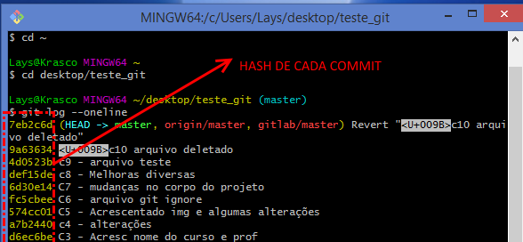
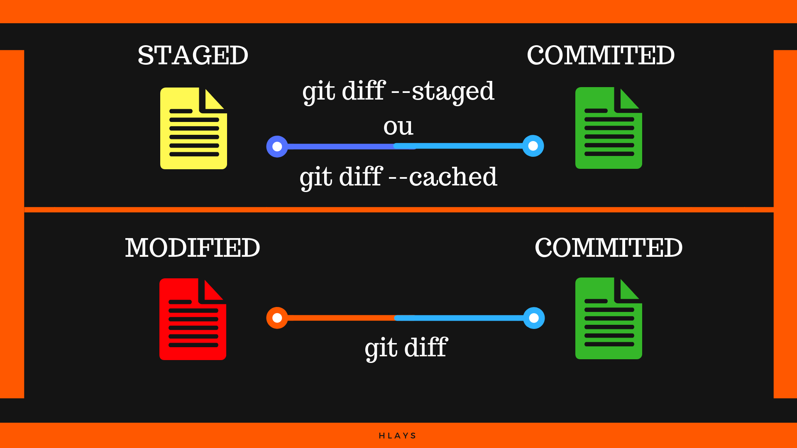

# Utilizando o Git - comandos básicos

*Os comandos abaixo devem ser executados no terminal.*

Quando quiser verificar se o repositório está conectado, digite:
```
git remote
```
(deverá aparecer: origin)

Para verificar os links do repositório remoto:
```
git remote -v
```

## Status do diretório

Este comando será muito utilizado durante o uso do Git, por ele poderemos visualizar qual o status de nossos arquivos, se untracked, modified, staged, commited..

```
git status
```

### Status dentro de pastas do diretório

```
git status -u
```

### Status resumido

```
git status -s
```

## Adicionar arquivos ao STAGED (add)
:::de UNTRACKED ou de MODIFIED para STAGED:::

Adiciona o arquivo para os cuidados do git (stage: área do Git)
```
git add nome do arquivo.extensão
```

Para adicionar todos os arquivos de uma vez:
```
git add .
```

## Commitar (commit)
:::de STAGED para COMMITED:::

Commitar (o git tira uma “foto” do estado atual do projeto p/ acompanhar as mudanças)

```
git commit -m “mensagem de minha preferência”
```

Ex:
```
git commit -m “C0 - Primeiro commit do projeto”
```

Obs: \*Se vc não colocar a mensagem, automaticamente ele irá abrir um editor de texto para que você digite a mensagem.

Neste caso, digite a mensagem no editor que irá abrir, crtl + S para salvar e depois feche o editor, ou digite q no git bash (se tiver aberto dentro do próprio prompt do git) para sair do editor.

## Atalho para add e commit de uma vez

Esse comando pode ser usado quando há a modificação dos arquivos.

Não funciona quando é a primeira vez que se está adicionando os arquivos, só quando o git já os conhece.

```
git commit -am “mensagem de minha preferência”
```

## Recapitulando...

Sempre que quiser atualizar uma mudança no repositório, repetir:

1.  `git add nome_do_arquivo_extensão`
2.  `git commit + mudanças realizadas ex: git commit -m “C1 - Alterações na parte de css do código”)`

Uma vez, que devemos passar os arquivos de MODIFIED para COMMITED novamente.

<!-- Sempre que ocorre alguma mudança em um arquivo, o Git inteligentemente irá mostrar no terminal todas as alterações sofridas pelo documento, com linhas na cor verde e sinal (+) para as linhas de código que são adicionadas ao arquivo e cor vermelha e sinal (-) para o que é retirado. -->

## Visualizar alterações (log)

Para visualizar todos os commits realizados Modo completo (tecle ENTER ou seta para baixo até chegar ao final (end).. para sair: tecle (q)

```
git log
```

### Visualizar Commits resumidos em 1 linha

```
git log --oneline
```

### Visualizar últimos commits

Para visualizar o ultimo commit em uma linha:
```
git log -1 --oneline
```

Para visualizar os 2 últimos commits em uma linha:
```
git log -2 --oneline
```

Assim, por diante, basta trocar o número. Para verificar não resumidos em uma linha, basta tirar o trecho de código --oneline.

### Visualizar alterações em todas as branchs resumidas em uma linha

Você visualizar todos os commits realizados no repositório independentemente da branch, através do comando:
```
git log --oneline --all
```

### Visualizar graficamente

Ou para ficar ainda melhor, é possível verificar graficamente:
```
git log --oneline --all --graph
```

### Visualizar detalhes de um commit específico

Visualização completa, contendo modificações realizadas:
```
git show número_da_hash
```

Você pode encontrar a hash de cada commit através do comando
```
git log --oneline
```

\>>> Por exemplo, quero informações sobre o commit C5, cuja hash é 574cc01.


Digito no terminal:

```
git show 574cc01
```

Para Visualização resumida (sem info sobre linhas de código modificadas):
```
git log -1 stat
```

### Visualizar commits pais

```
git log --parents --oneline
```
### Diferença entre commits

```
git log -p -posição_do_commit
```

Ex: Exibir histórico com diff das duas últimas alterações:
```
git log -p -2
```

### Ver histórico com formatação específica (hash abreviada, autor, data e comentário)

```
git log --pretty=format:"%h - %an, %ar : %s"
```

Onde:

*   %h: Abreviação do hash;
*   %an: Nome do autor;
*   %ar: Data;
*   %s: Comentário.

### Visualizar histórico de um arquivo específico pelo caminho

```
git log -- caminho_do_arquivo
```

### Visualizar histórico de um arquivo específico que contêm uma determinada palavra

```
git log --summary -S [caminho_do_arquivo]
```

### Exibir histórico modificação de um arquivo com parâmetros

O M pode ser substituido por: Adicionado (A), Copiado (C), Apagado (D), Modificado (M), Renomeado (R), entre outros.
```
git log --diff-filter=M --
```

### Visualizar commits de determinado autor

```
git log --author=nomedoautor
```

Ex:
```
git log --author=hlays
```

## Comparar commits: diff

Para comparar:

*   modified e commited:
    ```
    git diff
    ```
*   staged e commited:
      ```
      git diff --staged
      ```

      ou

      ```git diff --cached
      ```
*   commited e commited:
    ```
    git diff hash_do_commit_antigo..hash_do_commit_atual
    ```

### Visualizar últimas atualizações que estão em :::modified:::

Geralmente de um arquivo que você acabou de mexer e ainda não fez commit das últimas atualizações.
O console irá mostrar todas as modificações realizadas que estão diferentes da última atualização commitada pelo git (compara modified e commited).

Em verde (+) tudo o que foi acrescentado e em vermelho (-) tudo o que foi removido.

Tecle ENTER ou seta para baixo até chegar ao final do documento (END) e então tecle (q) para sair. Comando:
```
git diff
```

## Visualizar últimas modificações em um arquivo específico

```
git diff nome_do_arquivo.extensão
```

## Visualizar últimas atualizações que estão em :::staged:::

Para visualizar modificações que não estão em modified acrescentar (--staged ou --cached)
```
git diff --staged
```

## comparar modificações entre commits

```
git diff hash_do_commit_antigo..hash_do_commit_atual
```

Exemplo. Dados os commits abaixo, para comparar C5 e C6:

```
Lays@Krasco MINGW64 ~/desktop/teste\_git (master)

$ git log --oneline

99a627b (HEAD -> master) c7 - atualizações diversas
6d30e14 C7 - mudanças no corpo do projeto
fc5cbee C6 - arquivo git ignore
574cc01 C5 - Acrescentado img e algumas alterações
a7b2440 c4 - alterações
d6ec6be C3 - Acresc nome do curso e prof
13e1d6c outro html chamado curso com o link do curso
bd5dcc8 "add novo paragrafo em "
98f7dd4 C1 - h1 e parágrafo
e0a52d7 C0 - Primeiro commit
```

-> comando :
```
git diff 574cc01..fc5cbee
```

Resumindo...

