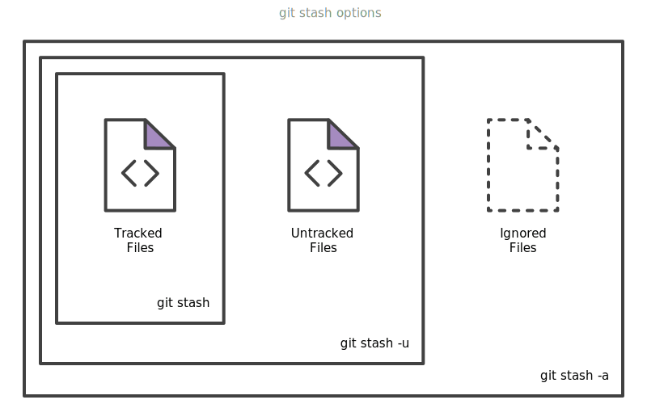

# Git Dicas
*Substituir comando entre < >*

## Renomear arquivo local

## 1ª opção: renomear pelo computador

1.  renomeie normalmente o arquivo pela pasta.
2.  Faça ```git add do arquivo```
3.  Assim ele irá passar para o estado de RENAMED quando você verificar pelo ```git status```
4.  Agora faça o commit do arquivo normalmente com ```git commit```

## 2ª opção: pelo Git

1.  No terminal:
    ```git mv nome_antigo.extensão novo_nome.extensão```
2.  Assim ele irá passar para o estado de RENAMED quando você verificar pelo ```git status```
3.  Agora faça o commit do arquivo normalmente com ```git commit``` para consolidar a mudança

# Editar url remota

```
git remote set-url origin https://github.com/USERNAME/REPOSITORY.git
```

Para conferir se a url foi editada com sucesso, basta digitar o comando abaixo e verificar o endereço correspondente:

```
git remote -v
```

## Desfazer alterações

Supondo que você deseja desfazer alterações no arquivo..vai depender em que ponto ele está: untracked, modified, commited.

\* Ao invés de desfazer, o mais aconselhado é reverter, para ao invés de apenas deletar a alteração, manter documentado. Ver reverter mais abaixo.

### Desfazer alterações: arquivo em :::untracked:::

```
git checkout --nome_do_arquivo.extensão
```

## Desfazer alterações: arquivos em :::modified::: (já feito add, mas não commit)

1.  1º tira ele de modified e leva de volta para untracked:
    ```
    git reset nome_do_arquivo.extensão
    ```
2.  2º já é possível fazer checkout e reverter alterações
    ```
    git checkout --nome_do_arquivo.extensão
    ```

## Desfazer alterações: arquivos já commitados

### 1º caso SOFT

Tirar arquivo de commit e passar de volta para staged, sem deletar o arquivo, usa-se o comando --soft + a hash do pai, ou seja, a hash do commit anterior ao que eu quero apagar. e depois é possível fazer o checkout.
```
git reset --soft hash_do_pai
```

### 2º caso MIXED

Tirar arquivo de commit e passar para modified (fora do staged), sem deletar o arquivo, usa-se o comando --mixed + a hash do pai, ou seja, a hash do commit anterior ao que eu quero apagar e depois é possível fazer o checkout.
```
git reset --mixed hash_do_pai
```

### 3º caso DELETAR HARD

Tirar arquivo de commit e deletar o arquivo (todos os commits e arquivos que estão depois do que o commit em questão deixam de existir, são deletados e fica só do commit pai/anterior para baixo). Usa-se o comando --hard + a hash do pai, ou seja, a hash do commit anterior ao que eu quero apagar e depois é possível fazer o checkout.
```
git reset --mixed hash_do_pai
```

## Reverter alterações

Quase semelhante ao desfazer, mas nesse caso será criado um commit que indica a reversão. É o mais aconselhado.

### 1° caso

Com mensagem sobre a reversão, neste caso o editor de texto irá abrir para que você insira a mensagem sobre o por que da reversão, ou digite (-m “mensagem”) após o hash
```
git revert hash_do_commit_a_ser_revertido
```

### 2° caso

Sem mensagem sobre a reversão:
```
git revert hash_do_commit_a_ser_revertido --no-edit
```

# Arquivo deletado manualmente pelo OS, como commitar

Quando deletar um arquivo do arquivo local de sua máquina, o git irá reconhecer isso e se você verificar no comando git status irá verificar que ele está em uma nova instância do git chamada “deleted” , para confirmar essa exclusão e manter documentado esse processo.

Deve-se:
```
git rm nome_do_arquivo.extensão
```
```
git commit
```

OU
```
git add nome_do_arquivo.extensão
```
```
git commit
```

Os dois métodos são distintos. Quando removemos pelo sistema operacional ou por alguma ide e queremos commitar essa ação, temos que add ao stage e commitar. Agora se commitarmos diretamente pelo git (com git rm) não precisamos fazer o add, pois a deleção já vai para a stage. Nesse caso é só um corte de caminho para não precisar usar o git add.

# Desfazer: arquivo deletado da máquina

```
git checkout -- nome_do_arquivo.extensão
```

# Remover arquivo/pasta pelo Git

## Remover arquivo

```
git rm nome_do_arquivo.extensão
```

## Remover pasta

```
git rm -r nome da pasta
```

## Remover/Desligar Git no repositório

Se por algum motivo não deseja mais usar o controle de versões e deseja desligar o Git do repositório (esse comando irá remover/deletar o Git do repositório em questão):

```
rm -rf .git/
```

Este comando irá deletar o arquivo onde o git guarda todas as informações e configurações do repositório.


## Histórico - Listar o que você fez no git

Enquanto o `git log` exibe apenas os commits, o `git reflog` exibe todo o histórico, incluindo: commits, checkout, merge, rebase etc.

```bash
git reflog
```

## Atalho para fazer push sem digitar o nome da branch em que você está (HEAD)
```bash
git push origin +HEAD
```

## Alterar (Reescrever) mensagem do último commit

```bash
git commit -m  'mensagem certa' --amend
```

ou (neste caso, irá abrir o editor no terminal para alterar):

```bash
git commit -v --amend

# digite
Y

# tecle enter
# altere a mensagem e depois ctrl + c para sair
```

## Refazer o último commit

### Refazer o último commit utilizando a mensagem do commit anterior

Considere ter esquecido alguma alteração em um arquivo após ter commitado. Você pode utilizar o `amend` para commitar de novo utilizando a mesma mensagem do último commit:

```bash
# primeiro add o arquivo e em seguida:

git commit --amend --reuse-message HEAD
```

ou

### Refazer o último commit

```bash
# primeiro add o arquivo e em seguida:

git commit --amend --no-edit
```

## Desfazer commits

- com **soft**: apaga só os commits
- com **hard**: apaga os commits e o código

### Desfazer o último commit

```bash
# mantendo as alterações do commit que você deseja desfazer:
git reset --soft HEAD^

# deletando todas as alterações do commit que você deseja desfazer:
git reset --hard HEAD^
```

### Desfazer commits por quantidade (do mais atual para o mais antigo)

```bash
# Desfaz apenas os commits
git reset --soft HEAD~<quantidade de commits>

# Desfaz os commits e o código
git reset --hard HEAD~<quantidade de commits>
```

## Procurar commits com uma mensagem/palavra

```bash
git log -S <"string-to-search">
```

## Verificar log entre datas

Exemplo:

```bash
git log --since='JAN 01 2019' --until='DEC 25 2019'
```

## Desfazer todas as alterações (untracked)

- visualizar arquivos que estão fora da *working tree*:
  ```bash
  git clean -n -d
  ```
- deletar arquivos:
  ```bash
  git clean -f -d
  ```

## Desfazer todas as alterações (tracked)

```bash
git checkout .
```

## Voltar (checkout) para versão anterior de arquivo

```bash
git checkout <hash> <file-name.extension>
```

## Renomear branch
- local:
  ```bash
  git branch -m <new-name>
  ```

- remota, seguir os passos adicionais:
  ```bash
  git push origin :<old-name> <new-name>

  # ou
  git push origin --delete <old-name>
  git push origin <new-name>
  ```

- Resetar a branch *upstream* para o novo nome da branch:
  ```bash
  git push origin -u <new-name>
  ```

## Remover arquivo adicionado acidentalmente

### Arquivo ainda não commitado:

```bash
git reset </path/file-name.extension>
```

### Arquivo já commitado:

```bash
git reset --soft HEAD~1

git reset </path/file-name.extension>

rm </path/file-name.extension>

git commit
```

## Desfazer merge e manter o histórico de commits

```bash
# ir para a master
git checkout master

# git log para verificar a hash correta
git log --oneline

# fazer a reversão utilizando a hash do merge correspondente
git revert -m 1 <merge-commit-hash>
```

## Remover tag de uma branch
- remota:
  ```bash
  git push origin :refs/tags/<tag-name>
  ```
- local:
  ```bash
  git tag -d <tag-name>
  ```

## Squash ('comprimir' commits em um só)
Considerando que você deseja comprimir/transformar seus últimos 5 commits em 1 só.. para isso fazemos o squash.

- desfaz os últimos 5 commits: `git reset --soft HEAD~5`
- faz o processo de add e commit com a mensagem certa
- faz push para o repositório remoto

## Cherry Pick

> git cherry-pick is a powerful command that enables arbitrary Git commits to be picked by reference and appended to the current working HEAD. Cherry picking is the act of picking a commit from a branch and applying it to another. git cherry-pick can be useful for undoing changes. For example, say a commit is accidently made to the wrong branch. You can switch to the correct branch and cherry-pick the commit to where it should belong.
> [Atlassian](https://www.atlassian.com/git/tutorials/cherry-pick)

### Pick 1 commit

```bash
git cherry-pick <hash>
```

### Pick vários commits

```bash
git cherry-pick <hash1> <hash2> <hash3>
```

### Pick de um commit até outro commit

```bash
git cherry-pick <hash1...hash3>
```

## git log do último commit
```bash
git log -1
```

---

## Git Stash
> O git stash armazena temporariamente as alterações que você fez na sua cópia de trabalho para poder trabalhar em outra coisa e depois voltar e reaplicá-las posteriormente.
> [Atlassian](https://www.atlassian.com/git/tutorials/saving-changes/git-stash)

Opções de Git stash ([Atlassian](https://www.atlassian.com/git/tutorials/saving-changes/git-stash)):


- stash **tracked files**:
  ```bash
  git stash
  ```

- stash também dos **untracked files**:
  ```bash
  git stash -u

  # -u = --include-untracked
  ```

- stash todos os arquivos, incluindo os **ignored files**:
  ```bash
  git stash -a

  # -a = --all
  ```

também é possível adicionar mensagens/descrições aos *stashs*, assim como fazemos com os commits:

```bash
git stash save <"message">
```

### Listar stashs

```bash
git stash list
```

### Deletar *stash* específica

```bash
git stash drop stash@{<index>}
```

### Deletar todas *stash*

```bash
git stash clear
```

### Reaplicando alterações que estão em *stash*

- Padrão, último *stash*:
  ```bash
  git stash apply
  ```
- Escolher qual *stash* (como em um array, utilize o `git stash list` para visualizar a lista de *stashs*):
  ````bash
  git stash pop stash@{<index>}
  ```

### Visualizar Stash diff (stash show)

```bash
git stash show

# ou, para visualização completa (-p = --patch):

git stash show -p
```

### Criar branch a partir de *stash*

```bash
git stash branch <branch-name> stash@{<index>}
```
