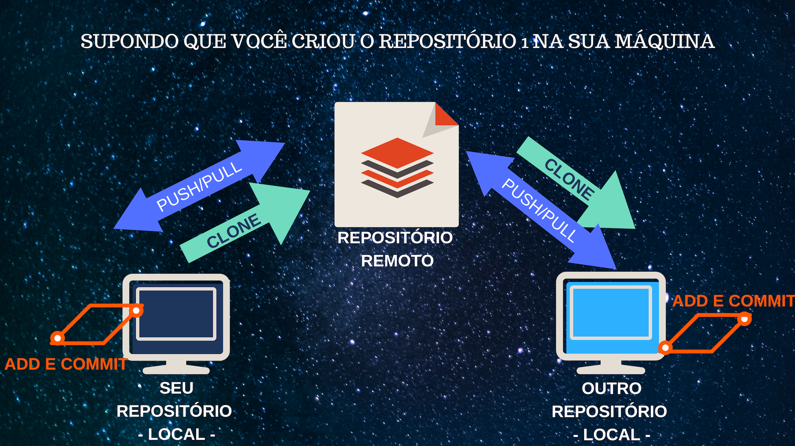
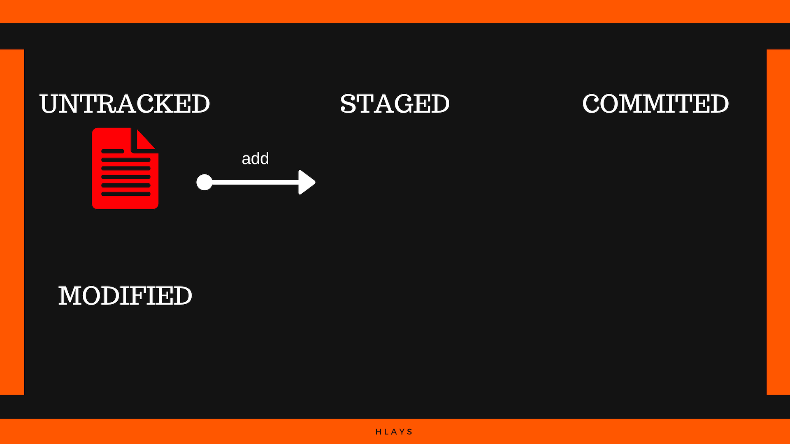
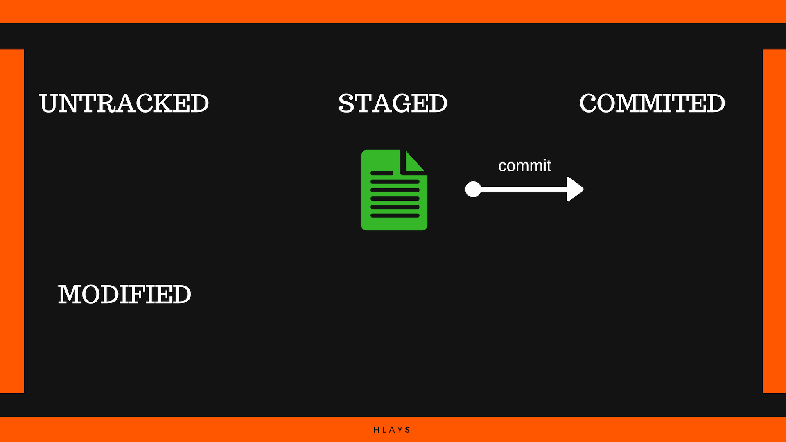
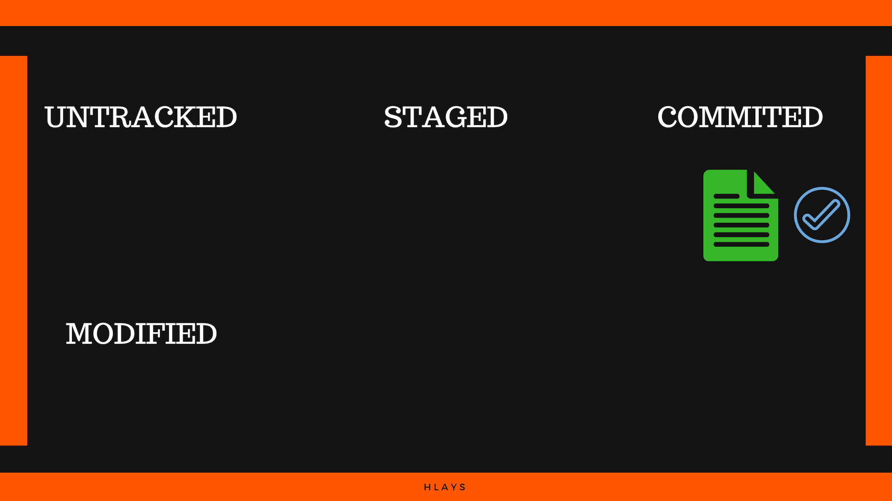
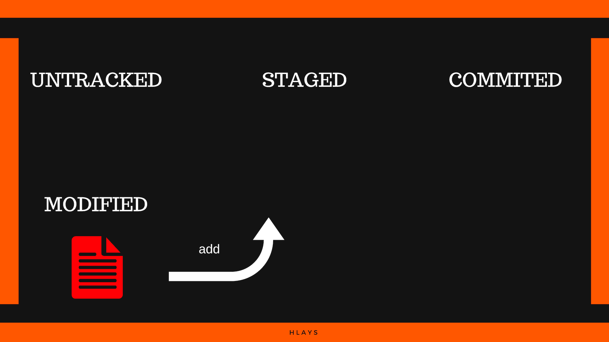
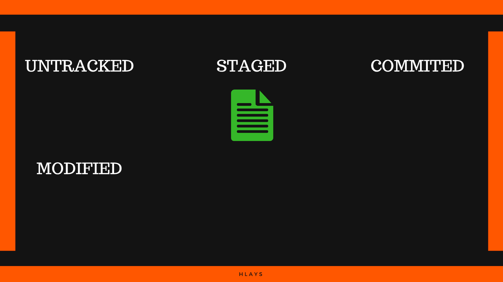
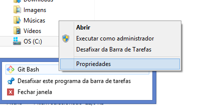
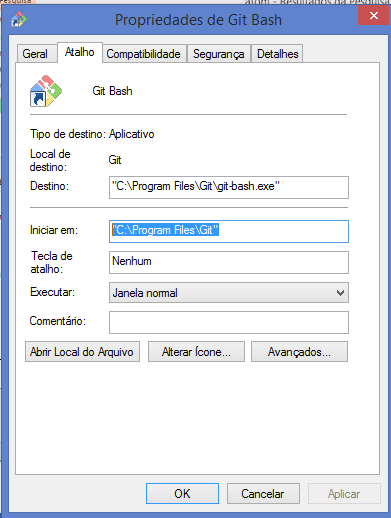

# GIT
*Lays Marie Hidani*

*************************
* [Git: conceitos](https://github.com/layshidani/my-learning-notes/blob/master/git/git.md)
  * [Git init: iniciando um repositório](https://github.com/layshidani/my-learning-notes/blob/master/git/basic-commands.md)
  * [Comandos básicos](https://github.com/layshidani/my-learning-notes/blob/master/git/basic-commands.md)
  * [Branchs](https://github.com/layshidani/my-learning-notes/blob/master/git/branchs.md)
  * [Git Ignore](https://github.com/layshidani/my-learning-notes/blob/master/git/gitignore.md)
* [Git dicas](https://github.com/layshidani/my-learning-notes/blob/master/git/git-tips.md)
* [Git alias](https://github.com/layshidani/my-learning-notes/blob/master/git/git-alias.md)
* [GitHub Badges + Travis + Coveralls](https://github.com/layshidani/my-learning-notes/blob/master/git/github-badges.md)
*************************

Git é um sistema de controle de versões. Todo o trabalho acontece na sua máquina (computador).

Já o GitHub é uma plataforma de hospedagem, controle de versão e colaboração. Funciona como uma espécie de "rede social" colaborativa dos programadores. Podendo visualizar o seu código e de toda a comunidade dentro da plataforma, clonar, etc.
[Faça o download do Git](https://git-scm.com/downloads)
[Acesse o GitHub](https://github.com/)

Quando falamos sobre **repositório local** estamos falando sobre o repositório (arquivos) que está na sua máquina versionado utilizando uma ferramenta de controle de versões como o git.

Já quando falamos sobre **repositório remoto**, nos referimos ao repositório hospedado em uma plataforma como o GitHub, por exemplo.

<!-- TODO escrever sobre a importância do versionamento -->

## Mais sobre o Git


> É um sistema de controle de versões distribuído, usado principalmente no desenvolvimento de software, mas pode ser usado para registrar o histórico de edições de qualquer tipo de arquivo. O Git foi inicialmente projetado e desenvolvido por Linus Torvalds para o desenvolvimento do kernel Linux, mas foi adotado por muitos outros projetos.
> Cada diretório de trabalho do Git é um repositório com um histórico completo e habilidade total de acompanhamento das revisões, não dependente de acesso a uma rede ou a um servidor central.
> \-Wikipedia-

> O workflow básico do Git pode ser descrito assim:
>
> 1.  Você modifica arquivos no seu diretório de trabalho.
> 2.  Você seleciona os arquivos, adicionando snapshots deles para sua área de preparação.
> 3.  Você faz um commit, que leva os arquivos como eles estão na sua área de preparação e os armazena permanentemente no seu diretório Git.
> \- GIT -

[Saiba mais](https://git-scm.com/book/pt-br/v1/Primeiros-passos-No%C3%A7%C3%B5es-B%C3%A1sicas-de-Git)

### Terminal

Os comandos e interação do Git se dá pelo terminal (prompt de comando/shell/etc), após a instalação, também serão adicionados dois novos terminais a sua máquina (built-in do Git): o Git CMD (padrão Windows) e o Git Bash (padrão MacOs e Linux).

Mesmo que seu OS seja Windows, Mac ou Linux, você pode optar por usar qualquer um dos terminais GitCMD ou Git Bash.

Você pode optar por usar o terminal de sua própria máquina, ou os terminais do Git, ou mesmo qualquer outro de sua preferência.

### GUI

Você poderá ainda usar o GUI ("Graphical User Interface"), onde, ao invés de executar os comandos via terminal, você poderá usar uma interface gráfica. O próprio Git já vem com um GUI na instalação (built-in): o Git GUI, mas existem outros para baixar conforme a sua preferência. Acesse o link abaixo para fazer o download: [GUIs](https://git-scm.com/downloads/guis)

## Mais sobre o GitHub


> GitHub é uma plataforma de hospedagem de código-fonte com controle de versão usando o Git. Ele permite que programadores, utilitários ou qualquer usuário cadastrado na plataforma contribuam em projetos privados e/ou Open Source de qualquer lugar do mundo. GitHub é amplamente utilizado por programadores para divulgação de seus trabalhos ou para que outros programadores contribuam com o projeto, além de promover fácil comunicação através de recursos que relatam problemas ou mesclam repositórios remotos (issues, pull request).
> \-Wikipedia-
>
> O GitHub é uma plataforma de hospedagem de código para controle de versão e colaboração. Ele permite que você e outros trabalhem juntos em projetos de qualquer lugar.
> \-GitHub- [Saiba mais](https://guides.github.com/)

Basta acessar o site do [GitHub](https://github.com/) e se cadastrar para começar a usar o site.

## Como funciona o repositório


<!-- TODO remover o título dessa img -->

## Alguns conceitos sobre como modificamos o estado dos arquivos no git

*   Clone: copiar/clonar repositório remoto no seu computador.
*   Add: comando para que o Git passe a "olhar" seus arquivos. Os arquivos passam de "Untracked" para "Staged" antes do 1º commit, e de "Modified" para "Staged", do 1º commit em diante
*   Commit: consolidar todas as mudanças.
*   Push (local -> remoto): sincronizar os arquivos do seu repositório local para o repositório remoto.
*   Pull (remoto -> local): sincronizar os arquivos do seu repositório remoto para o repositório local.
*
## Principais estados do git

* Não adicionado ao git (untracked)
* Preparado (staged/index)
* Modificado (modified)
* Consolidado (comitted)








### Untracked (sem rastro/não traçado)

É o primeiro estado do arquivo. Os arquivos estão na sua máquina, mas não estão aos cuidados do Git. Uma vez adicionado (`add`) ao Git, ele não volta mais ao estado de untracked.

### Staged ("palco"/área de preparo)

Depois de dar o comando "`add`" ao Git, os arquivos passam para a área "**staged**", onde o git já está cuidando dos arquivos e está de olho em todas as alterações que estão acontecendo.

Em uma definição livre, pode ser considerada uma área de preparo, uma espécie de "palco", onde o Git assiste da plateia todas as modificações :)

### Commit (Consolidar)

Depois que comitamos o arquivo ele passa para a área "**commited**", que em uma tradução livre, consolida todas as mudanças do arquivo, oficializa.

### Modified (Modificado)

Sempre que ocorrer uma modificação no arquivo, ele sairá de "**commited**" e passará para uma nova área chamada "**modified**".

Quando o arquivo é "`add`" pela primeira vez ele sai de "**untracked**" (não rastreado) e passa a ser rastreado pelo Git, dessa forma, ele não irá voltar a estar em "**untracked**".

Ao invés disso, sempre que houver uma modificação, ele sairá de "**commited**" e passará para "**modified**", aguardando ser adicionado (add) a "**staged**" novamente e depois ser commitado.

## Comandos Terminal

Utilizaremos para os exemplos o terminal Git Bash.

Sempre que for executar um comando git, o terminal deverá estar aberto na pasta do repositório em questão.

Ver [Diretório do repositório](#Diretório-do-repositório).

## Configuração inicial/preparatória

Essa configuração inicial que seguirá nos tópicos  é necessária somente quando inicia-se um novo repositório ou quando se deseja alterar alguma dessas configurações. Em repositórios já existentes, pula-se essa etapa.

## Configurar usuário

```
git config --global user.name nome_de_usuario
```

(ex: git config --global user.name hlays)

Tipos de usuário:

*   Global: configuração para minha máquina
*   System: todos os usuários dessa máquina vão usar o mesmo login
*   Local: para um repositório específico, caso específico. Por exemplo,uma pessoa usa sua máquina certa vez para commitar.

Assim, pode-se configurar como global, local, ou system, dependendo do caso. Na maior parte das vezes, utiliza-se global.

## Configurar email

```
git config --global user.email e-mail
```

ex:
```
git config --global user.email meuemail@gmail.com
```

## Verificar configuração

```
git config --global --list
```

Pode abreviar usando --l ao invés de --list
ex:
```
git config --global --l
```

## Trocar nome de usuário ou email

Basta executar o comando config de novo.

## Remover nome de usuário

```
git config --global --unset user.name
```

Neste caso, levando em consideração que foi configurado usuário como global.

## Remover e-mail

```
git config --global --unset email
```

Neste caso, levando em consideração que foi configurado usuário como global.

## Modificar o editor de texto padrão do Git

O editor de texto padrão do Git é o VIM, durante a instalação você também recebe um opção de alterar essa configuração. Mas se por algum motivo, depois de instalado, desejar mudar o editor padrão:
```
git config --global core.editor nome do editor que deseja
```

## Diretório do repositório

Navegue até o diretório através do comando `cd`.

```
cd caminho_da_pasta
```

Dicas de abreviação/atalho

*   Para voltar uma pasta acima/pasta anterior. Digite: cd ..
*   Diretório principal: cd ~
*   Listar o conteúdo de um diretório. Dentro da pasta em questão digite: dir
*   Adicionar local padrão (Se você está sempre usando o mesmo diretório e deseja deixá-lo como padrão para sempre que abrir o terminal): basta clicar com o botão direito do mouse sobre o ícone do terminal do Git >>> Propriedades >>> Atalho >>> Iniciar em: >>> coloque o caminho para o seu diretório padrão >>> Aplicar >>> ok
    
    

ex:
```
cd desktop/projetos/site
```

Para listar os arquivos da pasta `ls`

## Visualizar o arquivo oculto do Git

```
cd .git
ls
```

## Cadastrar chave SSH. Autenticação

Na primeira vez que você for fazer push de um repositório de sua máquina para o GitHub (somente a primeira vez mesmo, os próximos repositórios não necessitarão dessa configuração), você deverá gerar um conjunto de chaves SSH, uma pública e uma privada, elas servirão para autenticar seus gits no GitHub. Onde sua Chave pública do github será autenticada pela chave privada da sua máquina. Não se preoculpe que não é tão complicado quanto parece. Para acessar o passo-a-passo do próprio GitHub, basta acessar esse [link](https://help.github.com/articles/generating-a-new-ssh-key-and-adding-it-to-the-ssh-agent/).

### 1º passo: Gerar as chaves

No terminal digite o comando abaixo. Você deverá informar o mesmo e-mail que está cadastrado no GitHub
```
ssh-keygen -t rsa -b 4096 -C "your_email@example.com"
```

O prompt irá informar que está gerando as chaves. depois disso irá perguntar onde você deseja salvar a chave privada, se quiser no local já sugerido pelo git, basta teclar ENTER.

Depois disso ele irá perguntar se você deseja salvar uma senha adicional, geralmente não é necessário, então basta teclar ENTER. caso for inserir senha, deve-se digitar a senha e depois confirmar a mesma.

### 2º passo: Adicionar sua chave SSH pública

Entre no diretório das chaves salvas:
```
cd ~/.ssh/
```

Depois irá mostrar o nome das chaves, a que interessa é a .pub, copie o nome dela. Pode usar o comando \[cat\] ou \[more\].
Digite:
```
cat id_rsa.pub
```

Irá aparecer sua chave pública no terminal..copie.

Vá no site do Github, clique em sua imagem de perfil
(botão verde no canto superior direito da tela) >>> settings (lado esquerdo da tela) >>> SSH and GPG keys >>> new SSH key (botão verde no canto superior direito da tela) >>> Digitar o nome/titulo (geralmente coloca-se o nome do seu pc) e colar a chave >>> Add SSH Key.

## Sobre o parentesco entre commits

Os commits aparecem da ordem de criação mais recente para a mais antiga, e dizemos que o commit mais recente é filho do mais antigo, sucessivamente.
Ex:
```
$ git log --oneline
a7b2440 (HEAD -> master) C5 - Quinto commit
d6ec6be C3 - Quarto commit
bd5dcc8 C2 - Terceiro commit
98f7dd4 C1 - Segundo commit
e0a52d7 C0 - Primeiro commit
```
Então: C0 é pai de C1, C1 é pai de C2, C4 é filho de c3, etc.

***! Não escreva mensagens de commit como as do exemplo acima 'Segundo commit, Terceiro commit, etc'. Sempre escreva mensagens claras resumindo as alterações que você está fazendo no repositório. Lembre-se de que elas são um histórico do seu projeto.***

---

# Trabalhando com repositórios de outras pessoas

## Modo Colaborador

Geralmente, se você colabora com repositórios da empresa onde trabalha, ou em projetos opensource, por exemplo, dos quais você faz parte da equipe, quando você desejar enviar seus commits com alterações do repositório em questão, precisará estar ajustado no Git como Colaborador, caso contrário ao tentar fazer o commit, será informado de "acesso negado".

Para isso, o dono do repositório deverá ir até a página do repositório em questão, clicar em settings >>> colaborators >>> e inserir seu nome de usuário.

Assim, sendo um colaborador, toda vez que enviar um commit, o dono do repoitório será notificado sobre suas alterações e deverá permitir ou não que elas sejam consolidadas.

## Pull request

Geralmente, se você colabora com projetos opensource, por exemplo, dos quais você deseja colaborar de alguma forma, quando você faz alterações em arquivos e deseja commitá-los para o repositório original (que não foi criado por você), deverá solicitar essa permissão através do botão pull request no Github. Suas alterações serão avaliadas e consideradas pelos colaboradores oficiais do repositório.
Isso permite o controle sobre o projeto, sem que qualquer um mexa no repositório sem permissão e evitando alterações indesejadas.

## FORK, uma cópia de outros repositórios para o seu repositório

Quando você faz um fork, cria uma cópia de um repositório remoto de outra pessoa para o seu repositório remoto, assim quando fizer alterações e commits nos arquivos deste repositório, estes serão refletidos no seu repositório e não no original.

<!--
## Verificar se está conectado

```
git remote
```

Deve aparecer: origin, ou o nome que você tenha usado.

## Verificar detalhes do repositório no Github

```
git remote -v
```

# push: sincronizar alterações locais para o repositório do Github

Sempre que quiser atualizar os commits locais também no Github fazer:
```
git push origin master
```

# clone: trazer repositório remoto para o arquivo local

Este é o inverso. Quando você cria o repositório no Github e deseja trazer para a máquina, não basta fazer um simples download do repositório, pois não seria uma cópia completa, uma vez que, faria uma cópia dos arquivos simplesmente e não do repositório em si com o Git.
Será necessário clonar o repositório remoto utilizando o comando clone

Não esqueça de estar com o local que deseja salvar o repositório configurado no terminal
```
git clone endereço_do_repositorio
```

você deverá encontrar o endereço SSH do repositório na página do repositório do Github. Fica localizado em um botão verde do lado direito da tela. Você pode clonar tantos seus próprios repositório, quanto em repositórios criados por outras pessoas com quem irá trabalhar no projeto em questão.

## Sincronizar alterações do repositótio remoto para o local: `pull`

```
git pull origin master
```

origin, ou o nome que você tenha usado..

# \[remote add\] Repositório local para remoto - da sua máquina para Github

1.  criar um repositório no Github e copiar o endereço SSH do repositório.
2.  no terminal digitar:
    ```
    git remote add origin endereço_ssh
    ```
    Este nome origin pode ser o nome que você quiser, mas é mais comumente utilizado o origin. Este comando serve para adicionar seu repositório local no Github.
3.  enviar arquivos para o Github. Digite no terminal:
    ```
    git push origin master
    ```
4.  Da 1ª vez, irá pedir usuário e senha do Github, após informar, ele automaticamente irá fazer o push dos seus arquivos. -->
